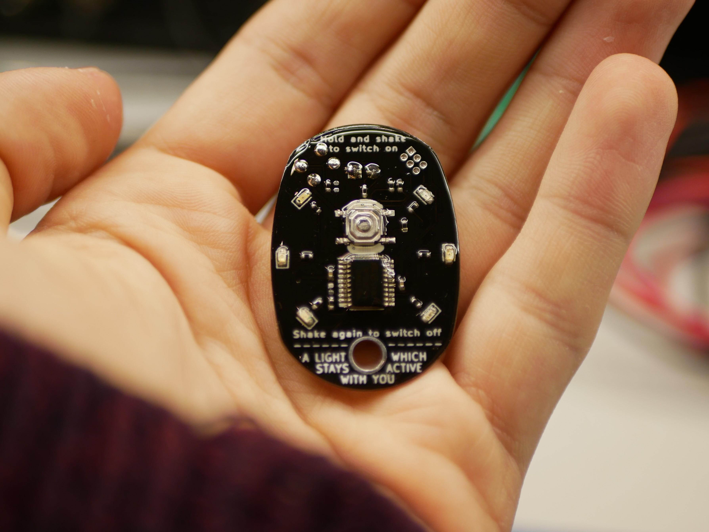
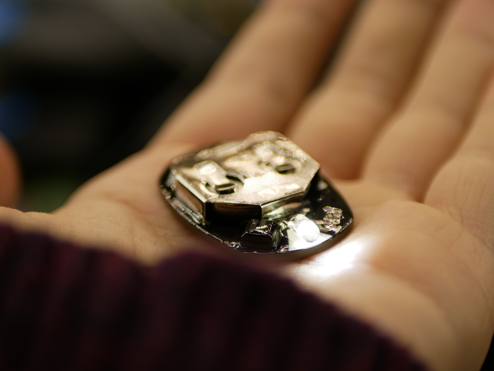

# coincell_flashlight project
Just a quick fun project to serve as a gift for Xmas. Nothing advanced here, the thing is based around the STM32F031F4. It spends most of its time in stop mode, is woken up by the RTC alarm event every 3 mins to check whether it's in motion and adjusts the activity value. There's also some additional functionality like flashlight and other modes.

It uses "scrambled PWM" for LED dimming (generated in the TIM1 update event callback). Everything about the PWM and fading is explained in the comments in flashligh_main.c file.

# Worklog
### Dec 5
Created the project

### Dec 9
Haven't done a great job of updating the worklog... Anyways. Went from trying to use Standby mode and IWDG to Stop mode and RTC Alarm. seems to work pretty nicely so far. It shouldn't even lose RAM content in Stop mode so that make's things much easier (we'll see how it affects the power consumption though). I'm also worried about any potential hiccups, before it would just restart all the time so that wasn't really an issue but now?

### Dec 10
It works beatifully, I'm now working on the menu entry implementation. Really like the way everything smoothly fades in and out and is responsive.

### Dec 19
Finished the second laquere layer on 5 units. I'm surprised it didn't mess with the buttons (one button died after I cleaned the board with isopropyl, no idea what's up with that). 
There's also an issue where the vibration sensor hangs in the on state drawing 30 uA. It seems to do it way more often than advertised in the datasheet, should have used higher pulldown resistor value.

### Dec 20
Calling the project finished for now.

### Dec 25
Updated README and added explanations for the timer routines.

### Jan 18
Observations so far:
* The button is small and hard to press, it also started showing signs of damage on my unit.
* Most of the other shake sensors are way more sensitive than the one I tested the "shake to switch off" feature originally. It makes the flashlight almost useless as a flashlight... 
These can be potentially fixed with a firmware update

Also, I could have used a spare GPIO to turn on the pullup resistors, which would have decreased the standby consumption. It didn't accur to me when I was designing the board. Maybe next time.
On the upside it is (apart from the occaisional button glitch) holding up very well on the keychain.

PS: I cloned this directory, tiped this log in nano, commited and pushed it from my phone using Termux :)

